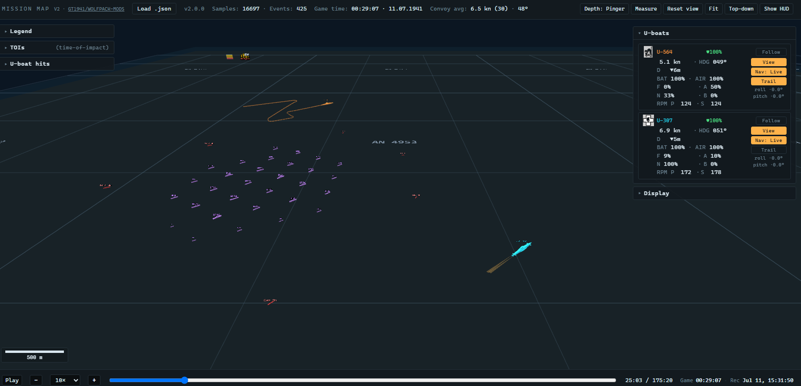

# Wolfpack BepInEx Mods

BepInEx mods for [Wolfpack](https://store.steampowered.com/app/490920/Wolfpack/) (pre-beta, IL2CPP). Requires [BepInEx 6 IL2CPP](https://github.com/BepInEx/BepInEx).

Released DLLs are grouped by mod and release status below. Older versions are available on the [Releases](../../releases) page if a new build ever regresses something for you and you need to step back — each release is tagged `<ModName>-v<version>` (e.g. `MissionMap-v1.9.34`) with that mod's DLL attached.

---

## MissionMap

Records every entity's position over the course of a mission and ships with a full 3D replay viewer.

**MissionMap 2.0 is coming soon.** The public release currently contains the archived pre-2.0 recorder and viewer under `missionmap/pre-2.0/`; the 2.0 recorder and viewer are still being finalized.

**Recorder** writes `BepInEx/MissionMap_<timestamp>.json` containing:
- U-boats sampled every 1 s (drops to 0.25 s during dives so under-keel tracks transitions): position, depth, speed, heading, HP, battery, under-keel clearance.
- Convoy ships every 15 s: position, heading, physical speed, ship-type name, HP, two-level alert flag (hard = target acquired, soft = investigating without target), target bearing on hard-alerted escorts, burning flag.
- Torpedoes and depth charges per tick whenever they're in flight (torpedo depth included).
- Seafloor depth markers tagged with a coarse / fine level so the viewer can replicate the in-game zoom-based LOD swap.
- Events: torpedo launch (with TDC range, set speed in kn, gyro, depth, type, magnetic flag, owner, tube), torpedo hit (with tube + server-synced time), ship sunk (name + tonnage), depth-charge fire/impact, gun fire/land, collisions, bottom hits, u-boat lost.
- Crew chart drawings (lines, circles, time-nodes, text annotations) with per-boat ownership.
- Mission settings, crew roster snapshots, and player connect/disconnect events.
- Top-level: ISO-8601 timestamp with timezone offset, in-game date, game-time anchor + measured game-time rate.

A 3D replay viewer is included at [`missionmap/pre-2.0/missionmap.html`](missionmap/pre-2.0/missionmap.html) — drop a mission JSON onto it. Three.js scene with to-scale hulls, a hierarchical Kriegsmarine naval grid that subdivides as you zoom, seafloor depth markers with zoom-based LOD, per-U-boat chart-drawing toggles, multi-TOI tracking, bathymetry sweep, per-boat hit stats, overspeed glow, and an under-keel warning system. Escorts carry alert glyphs (❗ when engaging, ❓ when investigating) and an optional 8 km red "heading ray" that aims at the AI's predicted intercept point when hunting. Convoy ships sprout two static searchbeams each at night when alerted.

MissionMap 2.0 preview:



**Discord auto-post (experimental):** there is an initial attempt at automatically posting the finished mission JSON (plus an optional summary, roster, and settings) to a Discord channel via webhook. It's off by default and configured entirely through the mod's BepInEx config file (`BepInEx/config/MissionMap.cfg`) — set a webhook URL and the post options there to enable it. Treat it as a work in progress.

**Notes:**
- **Host-only.** Only the host writes the recording. Dropping the DLL on every peer is harmless — non-host installs stay inert.
- Recording finalises when the mission ends cleanly (debrief).
- Ship hulls in the viewer are drawn to their real draught and height so torpedo running depths visually line up with the keel they would strike.
- A "lights on" indicator appears over every merchant while the convoy is fleeing, matching what the AI is actually doing in the moment.

**Install on:** host only (clients no-op silently).

---

## LogbookSeconds

Enhancements to the in‑game C‑menu logbook:

1. **Seconds upgrade** — rewrites timestamps from `HH:MM` to `HH:MM:SS` for finer time resolution.
2. **Torpedo launch metadata** — appends the torpedo's speed and detonator type to the launch entry the game just wrote. Example:
   ```
   14:07:12 LAUNCHED TORPEDO TUBE 1. (44kn magnetic)
   ```
3. **Torpedo hit tube + impact angle** — appends the firing tube and impact angle to each hit line so the captain can see which tube scored and how square the hit was:
   ```
   14:07:40 TORPEDO HIT HEAVY TANKER, TYPE 32. (tube 1, 78° impact)
   ```
4. **Friendly-fire reporting** — when a torpedo strikes another U-boat the game logs only a vague "premature" line; this rewrites it into a proper friendly-fire hit/sink report (firer, victim, tube, impact angle), and notes the loss on both boats if the hit is fatal.

Each player sees their own logbook locally — the mod doesn't change anything on the wire and is safe to run alongside other players with or without the same mod installed.

**Install on:** any client.

---

## LargerConvoy

Scales convoy size by a fixed multiplier — more merchants, armed merchants, carriers, sloops, corvettes, and destroyers spawn in every encounter.

> **Note:** The mission's success/scoring tonnage goal is **not** scaled — only the spawned convoy is. So with ×2 you'll see roughly twice as many targets, but the threshold to "succeed" the mission stays the same as the unmodded value, effectively making missions easier (more targets to chew through for the same objective).

> **Note:** Convoy and escort AI is not designed for these inflated counts. Expect odd behaviour — formation glitches, escorts overlapping or piling up, weird pathing, unusual detection/fleeing responses. The game's AI is balanced around the unmodded convoy size; this mod just scales the spawn counts.

**Install on:** host only.

### Variants

| DLL | Multiplier | Notes |
| --- | --- | --- |
| `LargerConvoy1_5x.dll` | ×1.5 | Gentle bump |
| `LargerConvoy2x.dll` | ×2 | Default |

> **Important:** Load only **one** LargerConvoy DLL at a time. Loading two would stack the multipliers — e.g. `1_5x` + `2x` would give ×3, not ×2. When switching variants, delete the old DLL from `BepInEx/plugins/` before dropping in the new one.

---

## LargerConvoyScaled (experimental)

Sibling of the LargerConvoy multiplier family with a different design: instead of a single ×N factor, it uses **per-size targets**, so the lobby size selector becomes a difficulty knob rather than a convoy-size knob. Every value is **configurable** (see below). Defaults:

| Convoy size | Scaled spawn | Scaled goal | Scaled escorts (S / C / DD) | Total escorts |
| --- | ---:| ---:| ---:| ---:|
| Small      | 225,000 t | 200,000 t | 0 / 4 / 1 |  5 |
| Normal     | 275,000 t | 250,000 t | 2 / 8 / 1 | 11 |
| Large      | 375,000 t | 350,000 t | 2 / 8 / 2 | 12 |
| Very Large | 475,000 t | 450,000 t | 2 / 8 / 3 | 13 |

Unlike the multiplier variants, this one also raises the mission's tonnage goal — the threshold needed to "succeed" — so the relative challenge stays roughly constant rather than collapsing under the extra targets. The host's setting propagates to every peer in the lobby. Escort counts are absolute per-size targets so the screen feels comparable even when the rolled encounter has a different default.

**Configuration:** on first run the mod writes `BepInEx/config/LargerConvoyScaled.cfg` with a section per lobby size (`[Small]`, `[Normal]`, `[Large]`, `[VeryLarge]`), each exposing `SpawnTonnage`, `TonnageGoal`, `Sloops`, `Corvettes`, and `Destroyers`. Edit the file and restart the game to apply. Keep each tier's goal at or below its spawn tonnage, or that size becomes unwinnable.

**Install on:** host only. **Do not load alongside any other `LargerConvoy*.dll`** — they would interfere with each other.

> Convoy/escort AI is not designed for inflated counts of this magnitude. Expect formation glitches and odd path-finding at the higher sizes.

---

## TorpedoLoadout

Sets the per-boat torpedo loadout to **14 steam (T1) and 14 electric (T2)**, applied to all 4 crews. The override catches every reload path — mission start, the lobby's reset button, default-loadout reload — so the count stays at 14/14 regardless of how the game tries to reset it.

**Install on:** host only.

---

## Game Time API

Exposes in-game state via a local HTTP API on port 1941 for use by webpages, OBS overlays, or other tools.

**Endpoint:** `http://127.0.0.1:1941/time` returns JSON, e.g.:

```json
{"time":"08:59:03","date":"01.09.1939","vessel":"U-552","missionActive":true}
```

A sample webpage that shows a countdown from current in-game time to a chosen impact time is provided at [`web/toi.html`](web/toi.html) — open it locally in any browser while the game is running.

**Install on:** any client.

---

## TimeHUD

Two small features in one mod:

1. **In-game clock HUD** — a small label in the top-right of the screen showing the current in-game clock (`HH:MM:SS` by default; seconds optional). Drawn over the game UI so it sits on top of every screen.
2. **Chat timestamps** — every chat line gets an `HH:MM:SS - ` prefix in front of the username, e.g. `08:13:24 - U-96: target sighted`. When the host has the mod installed, the timestamp is added once at the server and every peer sees it regardless of whether they have the mod themselves. Server time is the same on every peer, so the stamps line up across the lobby.

Both features are individually togglable in the mod's config file, with knobs for font size, whether to show seconds on the HUD, etc.

**Install on:** any client. Install on the host to add chat stamps everyone sees.

---

## RadioAPI

Exposes the in-game radio's send/receive stream as a local HTTP API on port 1942 for external tools and overlays.

**Endpoints:**
- `GET  /` — current radio state (channel, RX buffer).
- `POST /send-char`, `/send-text`, `/send-morse-bits` — transmit through the player's radio, network-replicated like typing on the in-game radio. Pacing follows the game's per-letter Morse duration so repeated letters key correctly. Scandinavian/German letters substitute to ASCII Morse digraphs (`Å → AA`, `Ø → OE`, `Æ → AE`, etc.).
- `POST /inject-char`, `/inject-text` — local-only test harness: drives the receive side without putting anything on the network. Useful for solo training / bot-sim.

A companion HTML frontend (codebook, Bot Sim panel, Enigma helper, Web Audio fallback synth) is available in the dev repo.

**Install on:** any client.

---

## Archived mods

Past mods kept under `archive/` for historical reference. Not actively
maintained — pull a DLL out and drop it into `BepInEx/plugins/` if you
want to try it, but expect drift against current game versions.

- **`archive/LogbookExport.dll`** — wrote a patrol-log summary file to
  `BepInEx/` after each mission (torpedo launches / hits, sinkings,
  first detection, summary totals). Superseded in practice by the
  much richer MissionMap JSON + viewer.
- **`archive/NetworkFix.dll`** — bumped the multiplayer network update
  rate to reduce rubber-banding and desync. Recent game patches appear
  to have addressed most of what it was working around.

---

## Installation

1. Install BepInEx 6 IL2CPP into the Wolfpack game folder. Use a recent **bleeding-edge** build (the `win-x64` IL2CPP artifact) from the official build server: <https://builds.bepinex.dev/projects/bepinex_be>
2. Drop the desired `.dll` files into `BepInEx/plugins/`
3. Launch the game

## Repository Structure

```
.
├── LargerConvoyScaled.dll
├── LogbookSeconds.dll
├── TorpedoLoadout.dll
├── Other Mods/
│   ├── EscortDCStock.dll
│   ├── GameTime_API.dll
│   ├── RadioAPI.dll
│   ├── SettingsKeeper.dll
│   └── TimeHUD.dll
├── archive/
│   ├── LargerConvoy1_5x.dll
│   ├── LargerConvoy2x.dll
│   ├── LogbookExport.dll
│   └── NetworkFix.dll
└── missionmap/
    ├── 2.0/                 # coming soon
    │   └── missionmap-2.0-preview.png
    └── pre-2.0/
        ├── MissionMap.dll
        ├── missionmap.html
        └── insignia/
```

Source is not currently public.

## Requirements

- Wolfpack pre-beta — Steam `testing` or `beta-beta` branch (Unity 2020.3, IL2CPP)
- BepInEx-Unity.IL2CPP-win-x64-6.0.0-pre.2 (the version these mods were built and tested against). Newer bleeding-edge builds from <https://builds.bepinex.dev/projects/bepinex_be> generally work too.

## Licence

The plugin DLLs, web viewer, and documentation in this repository are
**All Rights Reserved** — see [`LICENSE.txt`](LICENSE.txt) for the full
text. They are not open source; redistribution or modification requires
the copyright holder's written permission.

The linked dependencies retain their original licences, also reproduced
in `LICENSE.txt`:

- **BepInEx** — GNU Lesser General Public License, version 2.1
- **HarmonyX** (the Harmony2 fork bundled with BepInEx 6) — MIT
